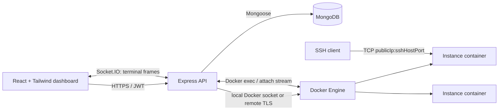

# Mini-AWS: Engineering Design and Boilerplate Guide

## 1. Scope and architecture

This platform provisions **short-lived, single-tenant Docker containers** that expose SSH on an allocated host TCP port. It is not a replacement for VM isolation: Docker shares a host kernel. Run the control plane and workload nodes on separate machines/accounts, and use a VM/microVM product when workloads are untrusted.



### Recommended deployment topology

* Put the React bundle behind a CDN/reverse proxy, and deploy Express as a stateless service behind HTTPS.
* Make the API call a **dedicated Docker worker** over mutually authenticated TLS. Do not mount `/var/run/docker.sock` into a publicly reachable API container; Docker socket access is effectively host-root access.
* Run MongoDB as a managed service/replica set with backups. Index ownership and lifecycle fields.
* Put the SSH port range (for example `20000-29999`) behind a firewall. Permit only the customer IP ranges where possible. The web API never needs to expose Docker directly.
* Use a queue (BullMQ/SQS) for provisioning if creation can be slow. The synchronous implementation below is suitable as a starting point but should time out and reconcile after failures.

### Instance lifecycle

`creating → running ↔ stopped → deleting → deleted`, with `error` as a recoverable terminal state. Store the Docker container ID as the source-of-truth reference; MongoDB is the desired-state and audit record. A reconciliation worker should periodically inspect non-deleted records and repair stale states.

### Repository layout

```text
mini-aws/
  instance-image/
    Dockerfile
    docker-entrypoint.sh
  api/
    src/config/env.js
    src/lib/docker.js
    src/models/Instance.js
    src/services/instance.service.js
    src/controllers/instance.controller.js
    src/routes/instance.routes.js
    src/middleware/auth.js
    src/app.js
  web/
    src/api/instances.ts
    src/components/InstanceTable.tsx
    src/components/LaunchInstanceDialog.tsx
    src/pages/InstancesPage.tsx
```

## 2. Base container image

Use an immutable, versioned image name such as `registry.example.com/mini-aws/ssh-instance:1.0.0`. The image is deliberately small and does not run `sshd` as root after its privileged startup work. Public-key authentication is mandatory; passwords and root login are disabled.

### `instance-image/Dockerfile`

```dockerfile
FROM alpine:3.21

RUN apk add --no-cache openssh-server tini \
    && addgroup -S instance \
    && adduser -S -D -h /home/instance -s /bin/ash -G instance instance \
    && mkdir -p /run/sshd /home/instance/.ssh \
    && chown -R instance:instance /home/instance/.ssh \
    && chmod 700 /home/instance/.ssh

# Harden OpenSSH. Host keys are generated only when the container first starts.
RUN printf '%s\n' \
  'Port 22' \
  'Protocol 2' \
  'PermitRootLogin no' \
  'PasswordAuthentication no' \
  'KbdInteractiveAuthentication no' \
  'ChallengeResponseAuthentication no' \
  'PubkeyAuthentication yes' \
  'AuthorizedKeysFile .ssh/authorized_keys' \
  'AllowUsers instance' \
  'X11Forwarding no' \
  'AllowTcpForwarding no' \
  'AllowAgentForwarding no' \
  'PermitTunnel no' \
  'GatewayPorts no' \
  'MaxAuthTries 3' \
  'LoginGraceTime 30' \
  'ClientAliveInterval 300' \
  'ClientAliveCountMax 2' \
  'UsePAM no' \
  'PrintMotd no' \
  > /etc/ssh/sshd_config

COPY --chmod=755 docker-entrypoint.sh /usr/local/bin/docker-entrypoint.sh

EXPOSE 22
ENTRYPOINT ["/sbin/tini", "--", "/usr/local/bin/docker-entrypoint.sh"]
CMD ["/usr/sbin/sshd", "-D", "-e"]
```

### `instance-image/docker-entrypoint.sh`

```sh
#!/bin/sh
set -eu

# An orchestrator-created, read-only file mount is preferable to an env var.
# It prevents a key from appearing in `docker inspect` output.
KEY_FILE="${SSH_AUTHORIZED_KEYS_FILE:-/run/secrets/authorized_keys}"
if [ -r "$KEY_FILE" ]; then
  install -o instance -g instance -m 600 "$KEY_FILE" /home/instance/.ssh/authorized_keys
else
  echo "No readable authorized-keys file; refusing to start" >&2
  exit 64
fi

# Container-local host keys must not be baked into the image.
ssh-keygen -A
exec "$@"
```

Build and test locally:

```sh
docker build -t mini-aws/ssh-instance:1.0.0 ./instance-image
```

At the Docker engine layer also set a read-only root filesystem, `no-new-privileges`, a non-root runtime user, dropped Linux capabilities, CPU/memory/PID limits, a private network, and no Docker socket mount. Give each instance a named volume only when persistence is an explicit product feature.

## 3. API orchestration

### Dependencies and environment

```sh
npm i express mongoose dockerode zod pino pino-http helmet cors express-rate-limit
```

```env
MONGODB_URI=mongodb://127.0.0.1:27017/mini_aws
DOCKER_SOCKET_PATH=/var/run/docker.sock
# For a remote engine, configure Dockerode with host/port/cert/key/ca instead.
INSTANCE_IMAGE=registry.example.com/mini-aws/ssh-instance:1.0.0
SSH_PUBLIC_HOST=ssh.example.com
SSH_PORT_MIN=20000
SSH_PORT_MAX=29999
INSTANCE_KEY_DIR=/var/lib/mini-aws/instance-keys
```

Authentication is assumed to populate `req.auth.userId`. Every query below scopes by `ownerId`; never accept an owner ID from the browser.

### `api/src/models/Instance.js`

```js
import mongoose from 'mongoose';

const instanceSchema = new mongoose.Schema({
  ownerId: { type: mongoose.Schema.Types.ObjectId, required: true, index: true },
  name: { type: String, required: true, trim: true, maxlength: 64 },
  dockerId: { type: String, unique: true, sparse: true, index: true },
  image: { type: String, required: true },
  state: { type: String, enum: ['creating', 'running', 'stopped', 'deleting', 'deleted', 'error'], default: 'creating', index: true },
  ssh: {
    host: { type: String, required: true },
    hostPort: { type: Number, min: 1, max: 65535 },
    username: { type: String, default: 'instance' }
  },
  lastError: String,
  deletedAt: Date
}, { timestamps: true, versionKey: false });

instanceSchema.index({ ownerId: 1, createdAt: -1 });
export const Instance = mongoose.model('Instance', instanceSchema);
```

### `api/src/lib/docker.js`

```js
import Docker from 'dockerode';
import { env } from '../config/env.js';

export const docker = new Docker({ socketPath: env.DOCKER_SOCKET_PATH });
```

### `api/src/services/instance.service.js`

```js
import fs from 'node:fs/promises';
import path from 'node:path';
import crypto from 'node:crypto';
import { docker } from '../lib/docker.js';
import { env } from '../config/env.js';
import { Instance } from '../models/Instance.js';

const labelPrefix = 'com.example.miniaws';

function securityOptions() {
  return {
    ReadonlyRootfs: true,
    SecurityOpt: ['no-new-privileges:true'],
    CapDrop: ['ALL'],
    PidsLimit: 128,
    Memory: 512 * 1024 * 1024,
    NanoCpus: 500_000_000, // 0.5 CPU
    NetworkMode: 'mini-aws-instances',
    // Docker chooses an unused host port. This avoids check-then-bind races.
    PortBindings: { '22/tcp': [{ HostIp: '0.0.0.0', HostPort: '' }] },
    Binds: []
  };
}

async function createAuthorizedKeysFile(publicKey) {
  const fileName = `${crypto.randomUUID()}.keys`;
  const filePath = path.join(env.INSTANCE_KEY_DIR, fileName);
  await fs.mkdir(env.INSTANCE_KEY_DIR, { recursive: true, mode: 0o700 });
  // Key format is validated at the request boundary; never interpolate shell text.
  await fs.writeFile(filePath, `${publicKey.trim()}\n`, { mode: 0o600 });
  return filePath;
}

export async function createInstance({ ownerId, name, publicKey }) {
  const record = await Instance.create({
    ownerId, name, image: env.INSTANCE_IMAGE, state: 'creating',
    ssh: { host: env.SSH_PUBLIC_HOST, username: 'instance' }
  });
  let keyPath;
  try {
    keyPath = await createAuthorizedKeysFile(publicKey);
    const container = await docker.createContainer({
      Image: env.INSTANCE_IMAGE,
      name: `mini-aws-${record._id}`,
      Labels: { [`${labelPrefix}.managed`]: 'true', [`${labelPrefix}.instanceId`]: String(record._id) },
      ExposedPorts: { '22/tcp': {} },
      HostConfig: {
        ...securityOptions(),
        Binds: [`${keyPath}:/run/secrets/authorized_keys:ro`]
      }
    });
    await record.updateOne({ dockerId: container.id });
    await container.start();

    const info = await container.inspect();
    const binding = info.NetworkSettings.Ports['22/tcp']?.[0];
    if (!binding?.HostPort) throw new Error('Docker did not publish SSH port');

    await record.updateOne({ state: 'running', 'ssh.hostPort': Number(binding.HostPort) });
    return await Instance.findById(record._id);
  } catch (error) {
    await record.updateOne({ state: 'error', lastError: error.message });
    // A queue/reconciler should remove any partially created Docker container.
    throw error;
  }
}

async function ownedContainer(instance) {
  if (!instance.dockerId) throw new Error('Instance has no Docker container');
  return docker.getContainer(instance.dockerId);
}

export async function setInstanceState(instance, action) {
  const container = await ownedContainer(instance);
  if (action === 'start') await container.start();
  if (action === 'stop') await container.stop({ t: 15 });
  if (action === 'restart') await container.restart({ t: 15 });
  const info = await container.inspect();
  const state = info.State.Running ? 'running' : 'stopped';
  return Instance.findByIdAndUpdate(instance._id, { state, lastError: null }, { new: true });
}

export async function deleteInstance(instance) {
  await instance.updateOne({ state: 'deleting' });
  try {
    if (instance.dockerId) await docker.getContainer(instance.dockerId).remove({ force: true, v: true });
    // In production, delete the per-instance key file too (store key-path/key ID in DB).
    return Instance.findByIdAndUpdate(instance._id, { state: 'deleted', deletedAt: new Date() }, { new: true });
  } catch (error) {
    await instance.updateOne({ state: 'error', lastError: error.message });
    throw error;
  }
}
```

The blank `HostPort` is important: Docker atomically assigns an available port and returns it via `inspect()`. Do not scan a range in Node, then assume that port remains free. If a strict port range is a product requirement, put a TCP proxy/load balancer in front of dynamically mapped internal ports, or serialize allocation in a transactional port-allocation service.

### `api/src/controllers/instance.controller.js`

```js
import { z } from 'zod';
import { Instance } from '../models/Instance.js';
import * as instances from '../services/instance.service.js';

const launchSchema = z.object({
  name: z.string().trim().min(1).max(64),
  publicKey: z.string().trim().min(40).max(16384)
    .regex(/^(ssh-ed25519|ecdsa-sha2-nistp(256|384|521)|ssh-rsa)\s+\S+/, 'Invalid SSH public key')
});
const actionSchema = z.object({ action: z.enum(['start', 'stop', 'restart']) });

export async function list(req, res) {
  const rows = await Instance.find({ ownerId: req.auth.userId, state: { $ne: 'deleted' } }).sort({ createdAt: -1 });
  res.json(rows);
}
export async function create(req, res) {
  const input = launchSchema.parse(req.body);
  const row = await instances.createInstance({ ownerId: req.auth.userId, ...input });
  res.status(201).json(row);
}
export async function action(req, res) {
  const input = actionSchema.parse(req.body);
  const row = await Instance.findOne({ _id: req.params.id, ownerId: req.auth.userId });
  if (!row) return res.sendStatus(404);
  res.json(await instances.setInstanceState(row, input.action));
}
export async function remove(req, res) {
  const row = await Instance.findOne({ _id: req.params.id, ownerId: req.auth.userId });
  if (!row) return res.sendStatus(404);
  await instances.deleteInstance(row);
  res.sendStatus(204);
}
```

### `api/src/routes/instance.routes.js`

```js
import { Router } from 'express';
import * as controller from '../controllers/instance.controller.js';
import { requireAuth } from '../middleware/auth.js';

export const instanceRouter = Router();
instanceRouter.use(requireAuth);
instanceRouter.get('/', controller.list);
instanceRouter.post('/', controller.create);
instanceRouter.post('/:id/actions', controller.action);
instanceRouter.delete('/:id', controller.remove);
```

Wrap async route handlers in an error middleware (translate Zod errors to 400, Docker errors to a safe 502/409); use Helmet, strict CORS origins, request IDs, rate limits, structured logs, and audit events. Never return raw Docker error objects to clients.

## 4. React and Tailwind dashboard

Use TanStack Query for cache/invalidation and a dialog primitive such as Radix/shadcn. The page contains a top bar, an instance summary, a launch dialog, and an accessible responsive table/card list. Keep private SSH keys on the user’s computer: the launch form accepts **only their public key**.

### `web/src/api/instances.ts`

```ts
export type Instance = {
  _id: string; name: string;
  state: 'creating' | 'running' | 'stopped' | 'deleting' | 'error';
  ssh: { host: string; hostPort?: number; username: string };
  createdAt: string; lastError?: string;
};

const request = async <T>(path: string, init?: RequestInit): Promise<T> => {
  const res = await fetch(`/api/instances${path}`, {
    ...init, headers: { 'content-type': 'application/json', ...init?.headers }, credentials: 'include'
  });
  if (!res.ok) throw new Error((await res.json().catch(() => null))?.message ?? 'Request failed');
  return res.status === 204 ? undefined as T : res.json();
};
export const instanceApi = {
  list: () => request<Instance[]>(''),
  create: (body: { name: string; publicKey: string }) => request<Instance>('', { method: 'POST', body: JSON.stringify(body) }),
  action: (id: string, action: 'start' | 'stop' | 'restart') => request<Instance>(`/${id}/actions`, { method: 'POST', body: JSON.stringify({ action }) }),
  remove: (id: string) => request<void>(`/${id}`, { method: 'DELETE' })
};
```

### `web/src/components/InstanceTable.tsx`

```tsx
import type { Instance } from '../api/instances';

const command = (i: Instance) => `ssh ${i.ssh.username}@${i.ssh.host} -p ${i.ssh.hostPort}`;

export function InstanceTable({ instances, onAction, onDelete }: {
  instances: Instance[];
  onAction: (id: string, action: 'start' | 'stop' | 'restart') => void;
  onDelete: (id: string) => void;
}) {
  return <div className="overflow-x-auto rounded-xl border border-slate-800 bg-slate-950">
    <table className="min-w-full text-left text-sm">
      <thead className="border-b border-slate-800 text-slate-400"><tr>
        <th className="p-4">Instance</th><th>State</th><th>SSH</th><th className="p-4">Actions</th>
      </tr></thead>
      <tbody>{instances.map(i => <tr key={i._id} className="border-b border-slate-900 last:border-0">
        <td className="p-4 font-medium text-white">{i.name}</td>
        <td><span className="rounded-full bg-slate-800 px-2 py-1 text-xs text-slate-200">{i.state}</span></td>
        <td>{i.state === 'running' && i.ssh.hostPort ? <button className="font-mono text-xs text-cyan-300 hover:text-cyan-200" onClick={() => navigator.clipboard.writeText(command(i))}>{command(i)} · Copy</button> : '—'}</td>
        <td className="space-x-2 p-4">
          {i.state === 'stopped' && <button onClick={() => onAction(i._id, 'start')}>Start</button>}
          {i.state === 'running' && <><button onClick={() => onAction(i._id, 'stop')}>Stop</button><button onClick={() => onAction(i._id, 'restart')}>Restart</button></>}
          <button className="text-red-300" onClick={() => onDelete(i._id)}>Delete</button>
        </td>
      </tr>)}</tbody>
    </table>
  </div>;
}
```

### `web/src/pages/InstancesPage.tsx`

```tsx
import { useQuery, useQueryClient, useMutation } from '@tanstack/react-query';
import { instanceApi } from '../api/instances';
import { InstanceTable } from '../components/InstanceTable';
import { LaunchInstanceDialog } from '../components/LaunchInstanceDialog';

export function InstancesPage() {
  const cache = useQueryClient();
  const refresh = () => cache.invalidateQueries({ queryKey: ['instances'] });
  const { data = [], isLoading } = useQuery({ queryKey: ['instances'], queryFn: instanceApi.list, refetchInterval: 10_000 });
  const action = useMutation({ mutationFn: ({ id, action }: { id: string; action: 'start'|'stop'|'restart' }) => instanceApi.action(id, action), onSuccess: refresh });
  const remove = useMutation({ mutationFn: instanceApi.remove, onSuccess: refresh });
  return <main className="min-h-screen bg-slate-950 p-6 text-slate-100 md:p-10">
    <div className="mx-auto max-w-6xl"><header className="mb-8 flex items-center justify-between"><div><p className="text-sm text-cyan-300">Mini-AWS</p><h1 className="text-3xl font-bold">Instances</h1></div><LaunchInstanceDialog onCreated={refresh} /></header>
      {isLoading ? <p>Loading instances…</p> : <InstanceTable instances={data} onAction={(id, a) => action.mutate({ id, action: a })} onDelete={(id) => { if (confirm('Permanently delete this instance?')) remove.mutate(id); }} />}
    </div>
  </main>;
}
```

`LaunchInstanceDialog` should use React Hook Form + Zod: fields `name` and a `<textarea>` for the public key, a disabled submit button while the mutation is pending, inline server validation errors, and `instanceApi.create(values)` followed by `onCreated()`. Avoid `confirm()` in final UI; use an accessible destructive-action modal.

## 5. Optional in-browser terminal

Do not expose SSH credentials or a generic Docker exec endpoint. Instead, authorize ownership at socket connection time, restrict a terminal to a specific instance, and create a fresh exec session:

1. Browser opens `wss://api.example.com/terminal` with its normal session/JWT and `{ instanceId }`.
2. Server verifies the user owns a `running` record, then calls `container.exec({ Cmd: ['/bin/ash'], AttachStdin: true, AttachStdout: true, AttachStderr: true, Tty: true })` and `exec.start({ hijack: true, stdin: true })`.
3. Bridge binary Docker stream frames to that one WebSocket and browser input back to the stream. With `Tty: true`, Docker does not multiplex stdout/stderr, which simplifies forwarding.
4. Use `xterm` + `@xterm/addon-fit` in React, send terminal `onData` to the socket, forward socket binary messages with `term.write`, and call `exec.resize({ h: rows, w: cols })` on resize.
5. Enforce connection timeout, idle timeout, per-user terminal limits, payload caps, audit logs, and close the Docker stream whenever the socket closes.

Pseudo-server bridge:

```js
io.of('/terminal').use(authSocket).on('connection', async socket => {
  const instance = await Instance.findOne({ _id: socket.handshake.auth.instanceId, ownerId: socket.userId, state: 'running' });
  if (!instance) return socket.disconnect(true);
  const exec = await docker.getContainer(instance.dockerId).exec({ Cmd: ['/bin/ash'], AttachStdin: true, AttachStdout: true, AttachStderr: true, Tty: true });
  const stream = await exec.start({ hijack: true, stdin: true });
  stream.on('data', chunk => socket.emit('output', chunk));
  socket.on('input', data => stream.write(data));
  socket.on('resize', ({ cols, rows }) => exec.resize({ w: cols, h: rows }));
  socket.on('disconnect', () => stream.destroy());
});
```

## 6. Production checklist

* Add user auth, tenant quotas, request rate limits, CSRF protection for cookie sessions, and audit events before launch.
* Validate image allowlists; never accept arbitrary images, mounts, commands, ports, environment variables, or Docker options from clients.
* Use rootless Docker or a tightly isolated worker fleet; scan/sign images and patch base images regularly.
* Configure firewall rules, per-user SSH keys, Docker resource limits, disk quotas, and automatic TTL expiration.
* Protect secrets with a secret manager. Treat instance key files as sensitive; rotate/revoke by recreating containers or using an authorized-key management plan.
* Build a reconciler for interrupted create/delete operations and emit lifecycle metrics, logs, traces, and alerts.
* Test: unit-test service error paths with mocked Dockerode; integration-test a real disposable Docker daemon; test authorization so one user cannot operate another user’s container; run image/security scanning in CI.

