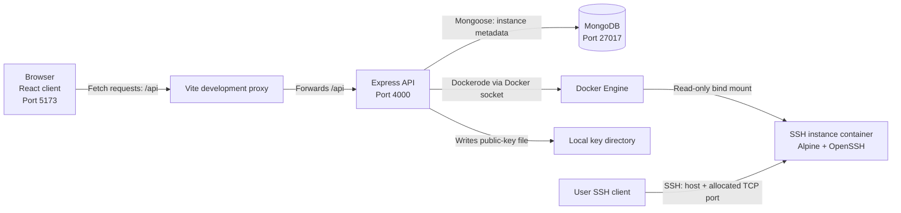

# Mini-AWS: Project Design Document

## 1. Objective

Build a lightweight, local cloud-instance management system that lets authenticated users launch, view, start, stop, restart, and delete isolated SSH-enabled Docker containers. The system automates instance provisioning, securely associates each instance with its owner's SSH public key, and tracks the complete instance lifecycle from creation to deletion.

## 2. Technical Stack

- **Frontend:** React 19, TypeScript, Vite, TanStack React Query, Tailwind CSS.
- **Backend:** Node.js, Express 5, Mongoose, Zod.
- **Database:** MongoDB 8.
- **Container runtime:** Docker Engine, controlled through Dockerode.
- **Instance image:** Alpine Linux 3.21, OpenSSH server, Tini.
- **Security middleware:** Helmet, CORS, express-rate-limit, Pino HTTP logging.
- **Credential storage:** Local server directory for short-lived public-key files (`instance-keys`).

## 3. System Architecture and Data Flow



1. A user enters an instance name and SSH public key in the React dashboard.
2. The frontend sends `POST /api/instances` through the Vite proxy.
3. The API validates the request, creates an initial MongoDB record with state `creating`, and saves the supplied public key in a restricted local file.
4. The API creates a Docker container with the key mounted read-only, starts it, and waits for Docker to allocate an SSH host port.
5. The API updates the instance record to `running` and returns the SSH connection information to the dashboard.
6. The user can later perform lifecycle actions or delete the instance. Deletion removes the Docker container and associated key file, then marks the database record `deleted`.

## 4. Detailed Design

### 4.1 Database Schema (MongoDB)

The `instances` collection stores the desired state, ownership, Docker reference, and SSH connection metadata for each launched instance.

| Field | Type | Purpose |
| --- | --- | --- |
| `_id` | ObjectId | Primary identifier for the instance. |
| `ownerId` | String, indexed | Identifies the user who owns the instance. |
| `name` | String (max 64) | User-provided instance name. |
| `dockerId` | String, unique/indexed | Docker container identifier. |
| `image` | String | Versioned Docker image used to create the instance. |
| `state` | Enum | `creating`, `running`, `stopped`, `deleting`, `deleted`, or `error`. |
| `ssh.host` | String | Public host name, normally `localhost` for local development. |
| `ssh.hostPort` | Number | Docker-assigned host TCP port mapped to container port 22. |
| `ssh.username` | String | SSH account name, default `instance`. |
| `keyFile` | String, excluded by default | Local path to the temporary mounted public-key file. |
| `lastError` | String | Most recent provisioning or lifecycle failure. |
| `deletedAt` | Date | Soft-delete timestamp. |
| `createdAt`, `updatedAt` | Date | Automatic Mongoose timestamps. |

Key indexes are `ownerId + createdAt` for each user's instance list, `dockerId` for container lookup, and `state` for lifecycle filtering.

### 4.2 Instance Lifecycle

```text
creating -> running <-> stopped -> deleting -> deleted
    |                                 
    +------------> error <------------+
```

- `creating`: Metadata has been created and the API is provisioning the Docker container.
- `running`: The container is active and has a mapped SSH port.
- `stopped`: The container remains available but SSH is unavailable until it is started.
- `deleting`: The API is removing the container and temporary key file.
- `deleted`: The lifecycle has completed; the record is excluded from normal listing.
- `error`: Provisioning or an operation failed; `lastError` provides diagnostic context.

### 4.3 API Design (Express)

Base path: `/api/instances`. All instance routes are rate-limited to 60 requests per minute and require authentication.

| Method | Route | Description |
| --- | --- | --- |
| `GET` | `/api/instances` | Lists non-deleted instances owned by the current user. |
| `POST` | `/api/instances` | Launches an instance. Body: `{ name, publicKey }`. |
| `POST` | `/api/instances/:id/actions` | Performs `start`, `stop`, or `restart`. Body: `{ action }`. |
| `DELETE` | `/api/instances/:id` | Force-removes the Docker container and deletes its public-key file. |
| `GET` | `/health` | Returns API health status. |

Example request to start an existing instance:

```http
POST /api/instances/66c1234567890abcdef12345/actions
Content-Type: application/json

{ "action": "start" }
```

### 4.4 Frontend Integration (React + Vite)

The React dashboard uses TanStack React Query to fetch the instance list every 10 seconds and invalidate the list after successful lifecycle operations. Browser requests use relative `/api` paths; Vite proxies them to the backend during local development, avoiding CORS complexity.

`web/vite.config.ts`:

```ts
export default defineConfig({
  plugins: [react()],
  server: {
    proxy: {
      '/api': 'http://localhost:4000'
    }
  }
});
```

Example frontend API call:

```ts
export const startInstance = (id: string) =>
  fetch(`/api/instances/${id}/actions`, {
    method: 'POST',
    headers: { 'content-type': 'application/json' },
    body: JSON.stringify({ action: 'start' })
  });
```

### 4.5 Docker Instance Design

Each launched instance is a container based on `mini-aws/ssh-instance:1.0.0`. Docker assigns an available host port for the container's SSH port 22, preventing race conditions from manual port selection.

- The SSH image accepts public-key authentication only; password and root login are disabled.
- A dedicated non-root `instance` user is the only allowed SSH login.
- The caller's public key is mounted read-only into the container and installed as `authorized_keys` at startup.
- The root filesystem is read-only; only required runtime paths use small `tmpfs` mounts.
- Containers drop all Linux capabilities, then add only the limited capabilities needed for SSH startup.
- Resource limits are set to 128 processes, 512 MiB memory, and 0.5 CPU.

## 5. Privacy and Security Considerations

- **Authentication:** `DEMO_AUTH=true` uses `x-user-id` / `local-user` solely for local development. Production must use verified JWT or session claims.
- **Authorization:** Every instance query is constrained by `ownerId`, so users cannot access another user's instance record through the API.
- **SSH key protection:** Public keys are stored with restrictive file permissions and deleted during instance removal. Private keys are never submitted to or stored by the application.
- **Docker socket risk:** Docker socket access has host-level privilege implications. The API must run as a tightly isolated worker and must never expose an unrestricted Docker socket through a public-facing service.
- **Input validation:** Zod validates instance names, accepted SSH key types, request shapes, and lifecycle actions. JSON payloads are capped at 20 KB.
- **HTTP protections:** Helmet supplies security headers, CORS restricts allowed browser origins, and per-route rate limiting reduces abuse.
- **Network exposure:** In production, firewall the allocated SSH port range and limit inbound SSH to approved customer IP ranges where possible.

## 6. Alternatives Considered

| Dimension | Proposed approach | Alternative option | Why not the alternative for this project? |
| --- | --- | --- | --- |
| Workload isolation | Docker containers | Virtual machines or microVMs | Docker enables a simple local MVP with fast provisioning, but VMs/microVMs are preferred for untrusted workloads because they do not share the host kernel. |
| Data persistence | MongoDB + Mongoose | PostgreSQL + Prisma/JPA | MongoDB suits the compact, document-shaped instance metadata and keeps the Node.js stack straightforward. |
| Container control | Local Docker socket with Dockerode | Remote orchestration via Kubernetes | Direct Docker control is simpler for a single-host project; an orchestrator is more appropriate for multi-host production deployments. |
| SSH credential handoff | Local, temporary public-key files | Secrets manager or Docker secrets | Local files are suitable for the local MVP. A secrets manager is recommended when scaling, auditing, or rotating credentials in production. |
| API style | REST endpoints | GraphQL | REST maps directly to lifecycle commands and is simpler for this small resource-oriented interface. |

## 7. Production Recommendations

Move the Docker worker off the public API host, replace demo authentication with an identity provider, use a remote Docker endpoint protected by mutual TLS, introduce a reconciliation worker for stale records, and add MongoDB backups and monitoring. For stronger tenant isolation, use a VM or microVM runtime instead of Docker containers.
